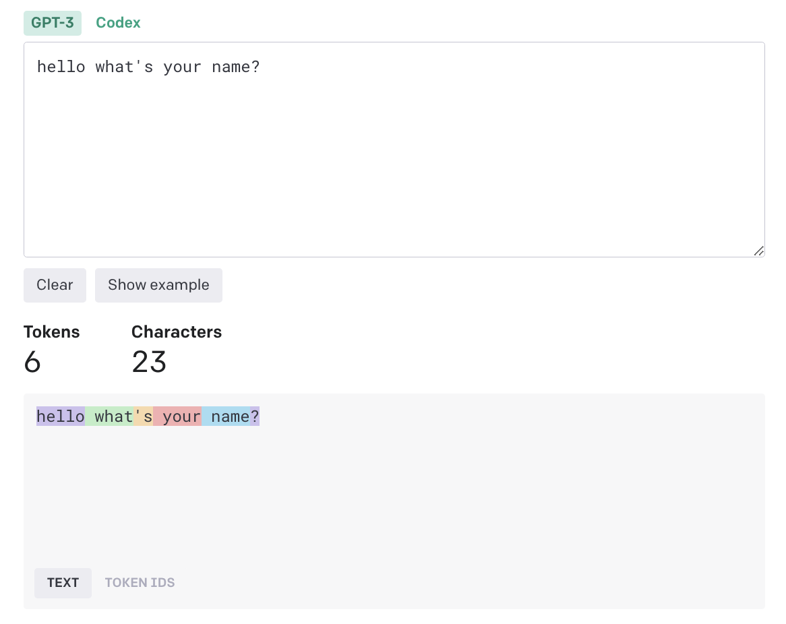

+ token是什么？
  
  + openai计费单位，按照输入token，输出token数量计算费用。

  + 大模型训练、推理本质是数值计算，文字需要转换为数字，通过文字转换得到的数字即为token。

+ token是怎么计算的？
  
  + 英文
  
    
    ```python
    [31373, 644, 338, 534, 1438, 30]
    ```
    一个有用的经验法则是，对于普通英语文本，一个token通常对应约4个字符的文本。这大约相当于一个单词的3/4（因此100个token~=75个单词）。
  
  + 中文

    

  + tiktoken
  
    通过openai开源的tiktoken工具，先生成`算法工程师` token然后再对token还原可以得到id代表的字节，例如：163 代表 b'\xe7'。

    通过对比`算法工程师` utf-8 字节，可以发现与上述id转换得到的字节一致。

    token生产流程：文字 =》 utf-8 字节 =》查表 =》 token id

    ```python
    import tiktoken

    text = "算法工程师"

    enc = tiktoken.encoding_for_model("text-davinci-003")
    token_list = enc.encode(text)
    print("token_list", token_list)

    for x in token_list:
        print(x, enc.decode_bytes([x]))

    print("text utf-8 bytes", bytes(text.encode('utf-8')))
    ```

    执行结果如下：
    

  + 不同模型对比
  
    https://github.com/openai/tiktoken/blob/main/tiktoken/model.py

    gpt-4, gpt-3.5, embeddings 用同一个词表 cl100k_base

    除gpt2, text-davinci-edit-* 其他用同一个词表 r50k_base

    不同词表token数量差别很大，例如 `算法工程师` 使用cl100k_base消耗6个token，但是使用p50k_base消耗12个token。

    ```python
    import tiktoken

    text = "算法工程师"

    enc_1 = tiktoken.encoding_for_model("gpt-4")
    token_list_1 = enc_1.encode(text)
    print("token_list_cl100k_base", len(token_list_1), token_list_1)

    enc_2 = tiktoken.encoding_for_model("text-davinci-003")
    token_list_2 = enc_2.encode(text)
    print("token_list_p50k_base", len(token_list_2), token_list_2)

    # token_list_cl100k_base 6  [70203, 25333, 49792, 39607, 13821, 230]
    # token_list_p50k_base   12 [163, 106, 245, 37345, 243, 32432, 98, 163, 101, 233, 30585, 230]

    ```


    ```python
    MODEL_TO_ENCODING: dict[str, str] = {
        # chat
        "gpt-4": "cl100k_base",
        "gpt-3.5-turbo": "cl100k_base",
        "gpt-35-turbo": "cl100k_base",  # Azure deployment name
        # text
        "text-davinci-003": "p50k_base",
        "text-davinci-002": "p50k_base",
        "text-davinci-001": "r50k_base",
        "text-curie-001": "r50k_base",
        "text-babbage-001": "r50k_base",
        "text-ada-001": "r50k_base",
        "davinci": "r50k_base",
        "curie": "r50k_base",
        "babbage": "r50k_base",
        "ada": "r50k_base",
        # code
        "code-davinci-002": "p50k_base",
        "code-davinci-001": "p50k_base",
        "code-cushman-002": "p50k_base",
        "code-cushman-001": "p50k_base",
        "davinci-codex": "p50k_base",
        "cushman-codex": "p50k_base",
        # edit
        "text-davinci-edit-001": "p50k_edit",
        "code-davinci-edit-001": "p50k_edit",
        # embeddings
        "text-embedding-ada-002": "cl100k_base",
        # old embeddings
        "text-similarity-davinci-001": "r50k_base",
        "text-similarity-curie-001": "r50k_base",
        "text-similarity-babbage-001": "r50k_base",
        "text-similarity-ada-001": "r50k_base",
        "text-search-davinci-doc-001": "r50k_base",
        "text-search-curie-doc-001": "r50k_base",
        "text-search-babbage-doc-001": "r50k_base",
        "text-search-ada-doc-001": "r50k_base",
        "code-search-babbage-code-001": "r50k_base",
        "code-search-ada-code-001": "r50k_base",
        # open source
        "gpt2": "gpt2",
    }
    ```

+ 参考资料
  
    +  https://platform.openai.com/tokenizer

    + https://github.com/openai/tiktoken
